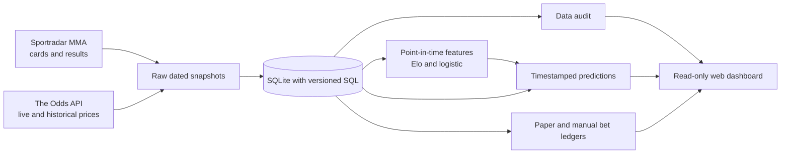

# Web application plan

## Intended final deliverable

The finished project should be a reproducible data and modeling pipeline **and** a small web dashboard. The Python package and SQLite database remain the source of truth. The web app reads verified predictions and source timestamps; it does not calculate a fresh model inside a page request or place wagers.

For a first portfolio or personal release, use **Streamlit** as a local, read-only dashboard. It keeps the interface in Python and can display the existing SQLite data without a second API service. If the project later serves multiple people, move the database to PostgreSQL and add a FastAPI service with user authentication and scheduled workers.

## Dashboard pages

1. **Upcoming card:** UFC-only bouts, fighter IDs, start time, model probability, latest bookmaker price, age of the quote, and the data cutoff. Show `no_quote` or `unavailable` when evidence is missing.
2. **Model evidence:** train/validation/test date ranges, Elo and logistic accuracy/Brier/log loss, five-bin calibration, bookmaker coverage, and matched-subset comparison. Label small samples visibly.
3. **Data quality:** latest ingestion receipts, identity conflicts, substitutions, missing results, and historical price coverage from `ufc-model audit`.
4. **Paper ledger:** capped simulated stakes, open exposure, results, and unresolved draw/no-contest/cancellation cases. Keep actual manually entered wagers in a separate view.

The first release covers pre-fight decisions only. The [latency policy](LATENCY_POLICY.md) defines a fresh-price gate for local alerts and the evidence needed before any future in-play work.

## Data flow

## Build order

1. Populate a checked UFC history. Choose one primary fight-data provider. Link a second provider's fighter IDs explicitly before mixing histories.
2. Save historical odds snapshots at a fixed pre-event time, or collect live prices and paper-trade prospectively. Audit quote availability and freshness.
3. Run `ufc-model evaluate` on chronological event-date splits. Review calibration and quote coverage before using the word “edge” in the UI.
4. Add a Streamlit app that reads stored reports and audit results. Keep API keys and ingestion jobs on the server side.
5. Only if the project needs shared accounts or unattended operations, add PostgreSQL, an API service, authentication, and a scheduled ingestion worker.

## Current limits

The repository has no licensed live data credentials, so the adapters are covered by offline fixtures and cannot yet prove end-to-end live coverage. The current database has no historical age, reach, or per-fight stat snapshots. Do not display those as model inputs until they can be reconstructed at each prediction cutoff. Event start is a conservative time reference for all bouts on a card; individual bout start times and bookmaker settlement rules need separate source data for more exact simulations.
